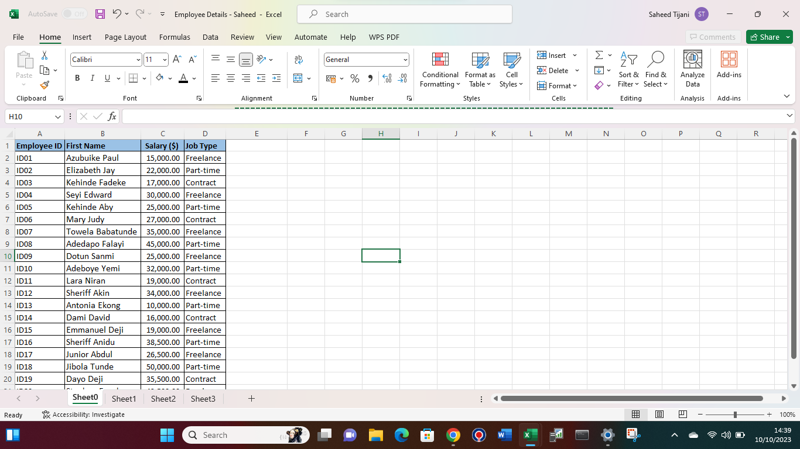
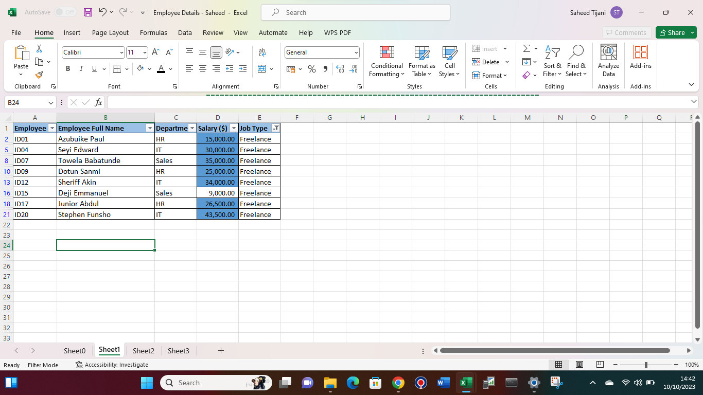
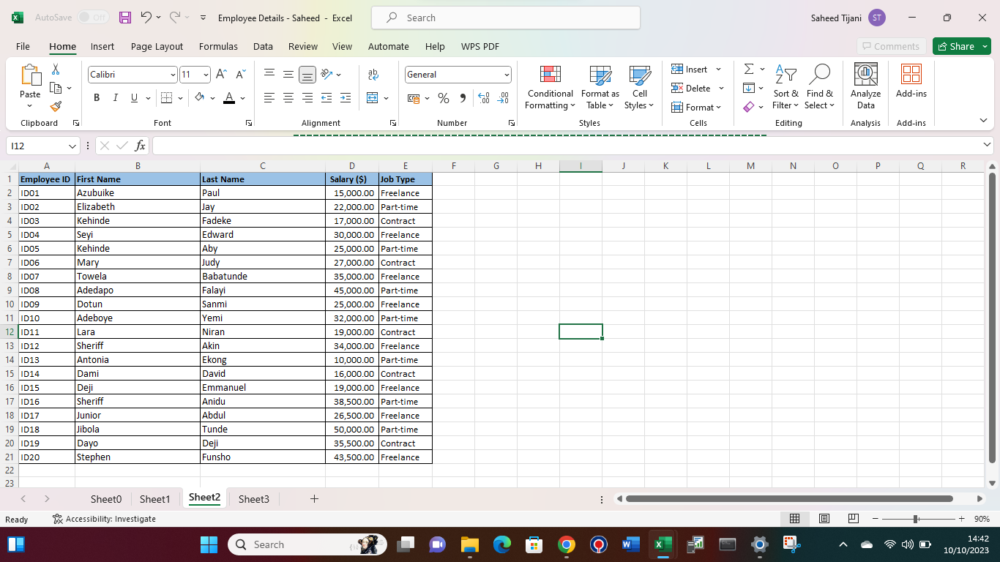
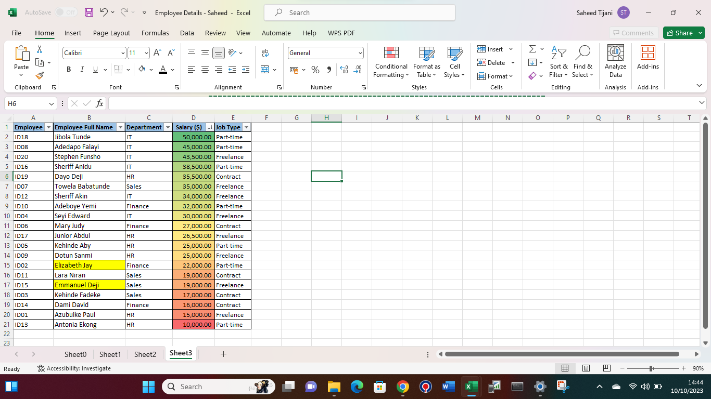

# Data Analysis - Training Tasks

EXCEL TASK 1

**For this task, we were required to create a table with 20 rows of information having the fields: Employee ID, Employee Full Name, Department, Salary and Job type**.

I designed a table and came up with random names. For the employee ID, I used a straightforward identification method. Then the remaining columns were also randomnly chosen.
To enhance the visibility, I applied borders to the datasets and added background color to the column headers. I named the worksheet as "Sheet0" then I duplicated the datasets onto Sheets 1,2, and 3, as i had additional tasks to carryout within the same worksheet.

**For sheet 1, I was asked to show only employees who are 'Freelancers' and highlight the ones whose salaries are above $10,000**

I began by selecting the 'job type' column and applied a filter, narrowing down the results to display only the freelance employees. Following that, I employed conditional formatting in the 'salary' column to emphasise salaries exceeding $10,000.

**For sheet 2, I was asked to split the employees full names into first name and last name, and check for duplicates and highlight if there are any.**

To achieve this, I utilized the 'Text to Columns' feature found on the 'Data' tab in Excel. Initially, I inserted an additional column following the 'Employee Name' column. Then, I selected the 'Employee Name' column and accessed the 'Text to Columns' option on the 'Data' tab.
The data type 'Delimited' was already chosen, so I proceeded to the next step. I selected 'Space' as the delimiter and continued to the subsequent step. The data type was already set to 'General,' and the destination column was automatically designated as the current column. 
Upon clicking 'Finish,' I was prompted if I wanted to replace the data in the column, to which I responded with yes. As a result, the first and last names were successfully separated into the selected column and the newly created one. Notably, there were no duplicates present.

**For the last sheet, I had to highlight employees whose names begin with the letter E in yellow and format the salary column such that the highest salary has a green background, and the lowest salary has a red background**

Firstly, I choose the 'Employee Name' column. Afterward, I navigated to the 'Conditional Formatting' menu and clicked on 'Highlight Cell Rules.' From there, I selected 'More Rules.'
I proceeded to modify the rule description to specify that only cells containing text commencing with 'E' should be formatted, and I assigned the color yellow for this formatting.
Subsequently, I organized the 'Salary' column in descending order, arranging it from the largest to the smallest values. Lastly, I applied the 'Green-Yellow-Red' color scale in the 'Conditional Formatting' options to emphasize the salary range

